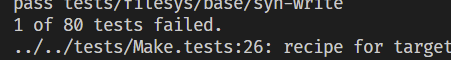
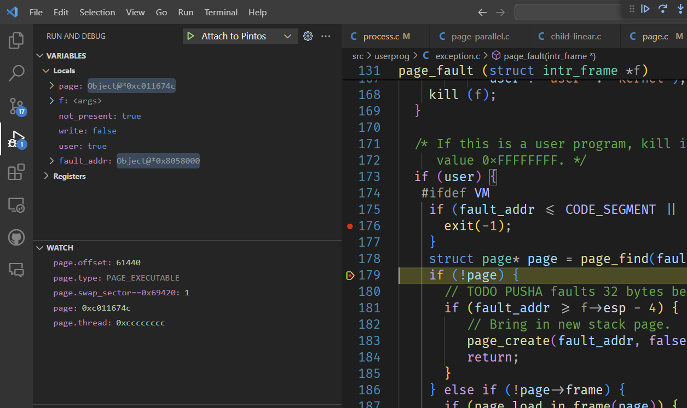

# Pintos OS

An implementation of the Pintos operating system project developed by me for my operating systems class, CSCC69.
Pintos is an operating system framework made by Stanford for the 80x86 architecture. [See the documentation here](https://web.stanford.edu/class/cs140/projects/pintos/pintos_1.html).

This implementation tries to be minimal, and passes all tests for Project 1: Multithreading, Project 2: User Programs, Project 3: Virtual Memory, and all base tests for Project 4: Filesystem.

## Usage

The project comes with a Dockerfile to make simulating Pintos' 80x86 instruction set easy. The docker container runs Ubuntu with the Qemu and Bochs emulators installed. I have also updated the Dockerfile to run on Ubuntu 20.04, in order to support VSCode's remote development feature, which makes debugging with GDB easier. See the documentation for more information on how to run pintos.

## The Journey

<figure>
  
  <figcaption>Implementing priority donation for locks! (Feb 5, 2024)</figcaption>
</figure>

<figure>
  
  <figcaption>One more test... so close, yet possibly so far. (Feb 24, 2024)</figcaption>
</figure>

<figure>
  
  <figcaption>Debugging page faults, cause virtual memory is always a culprit. (March 18, 2024)</figcaption>
</figure>

